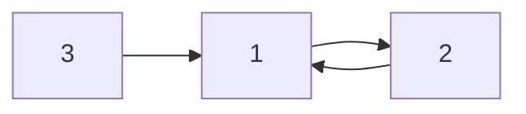

>**헤더**

# 안녕하세요!
## 다음을 시작 합니다!
### 자, 그럼 확인해 봅시다.
#### 첫번째로 할 것 

**굵게 blod**
*기울임*
_기울임_
**_기울임 + bold_**

> **인용문**

<u>밑줄</u>
~~취소선~~

>**불릿**
- list 불릿
    - list 불릿
        - list 불릿
* list 불릿
    * list 불릿
        * list 불릿
            - list

>**넘버 리스트**

1. num 넘버 리스트 작성
2. 넘버
4. 넘버리스트 숫자가 중간에 바뀌어도 3번으로 뜸

>**표 , 테이블**

|제목|DESCRIPTION|비고|
|-|-|-|
|안녕|1|2|
|할로|3|4|

>**url 링크**

[내가 참고한 링크](https://github.com/roamgom/About_Markdown)

자동 링크
<https://github.com/roamgom/About_Markdown>

>**이미지**


>**코드**
``` python
import i 
```
`ctrl + D`를 사용해도 좋다.

>**다이어 그램**


